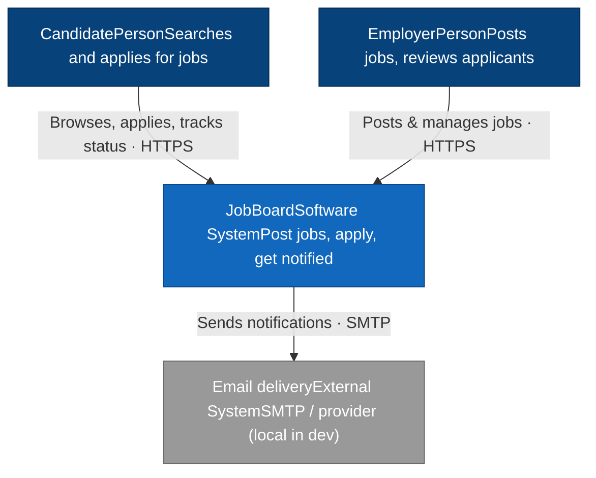
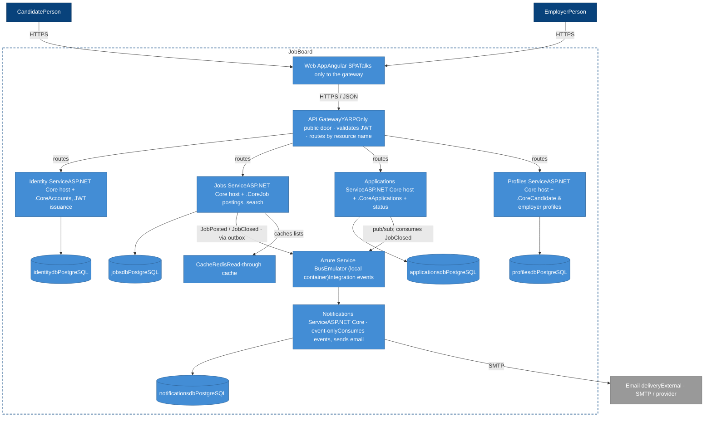
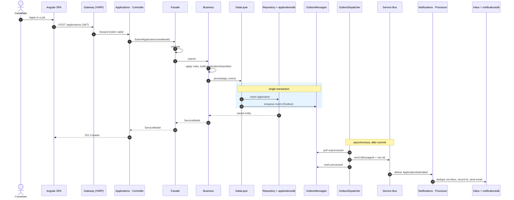
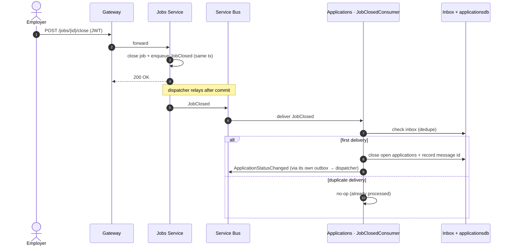
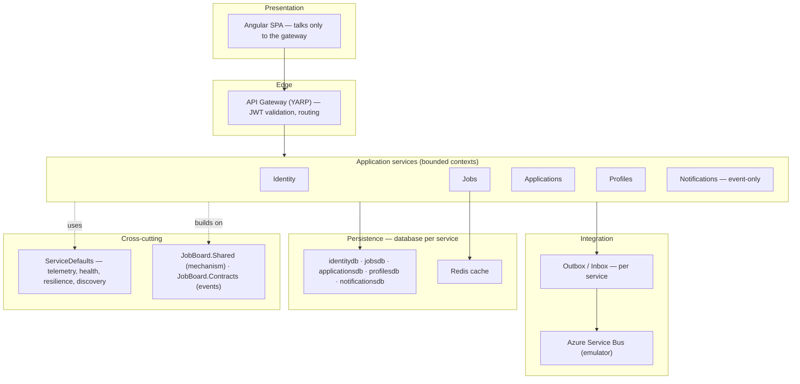
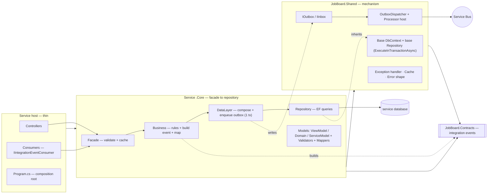

# JobBoard

A job-board platform built as **Aspire + ASP.NET Core microservices + Angular**, developed hand-in-hand with **Claude Code**. Everything runs locally: Aspire's AppHost orchestrates every service, the gateway, the Angular app, and all backing resources (PostgreSQL with a database per service, the Azure Service Bus emulator, a cache) as local containers — no cloud dependencies.

This repo is two things at once: a genuinely good microservice app, and a reproducible demonstration of driving a multi-service .NET stack agentically with Claude Code.

## What's in the box (right now)

This is the **toolkit and plan**, ready to generate `src/`:

```
.
├── CLAUDE.md               # project constitution (SCRUB) — auto-loaded by Claude Code every session
├── .claude/                # the Claude Code toolkit: skills, subagents, hooks, rules, settings
├── docs/
│   ├── README.md           # docs index
│   └── scrub-prompts.md    # the ordered SCRUB prompts that scaffold the whole system
├── Directory.Build.props   # shared build settings (net10.0, nullable, warnings-as-errors)
├── Directory.Packages.props# central package management (versions added at scaffold time)
├── global.json             # SDK band pin (roll-forward friendly)
├── .editorconfig           # style + naming, mirrors .claude/rules/backend.md
├── .vscode/                # recommended extensions + workspace settings
├── .gitignore
└── README.md
```

`src/` does not exist yet — you create it by running the prompts in `docs/scrub-prompts.md`. New projects scaffolded under `src/` automatically inherit `Directory.Build.props` and central package management.

## Architecture at a glance

- **Gateway** (YARP) — the only public door; the Angular app talks to nothing else.
- **Services** — `Identity`, `Jobs`, `Applications`, `Profiles`, `Notifications`. Each is a **thin host** + a **`.Core`** class library (facade → business → data → repository), with **its own database**. No shared database, ever.
- **Shared** — `JobBoard.Shared` (cross-cutting mechanism: base context, base repository, outbox/inbox, dispatcher, processor host, exception handler, cache) and `JobBoard.Contracts` (integration-event records — the only shared *contract*).
- **Messaging** — Azure Service Bus (emulator in dev) with a **hand-rolled transactional outbox**; consumers are idempotent via an inbox.

The full ruleset is in `CLAUDE.md` and `.claude/rules/`.

## Architecture diagrams

> Rendered with [Mermaid](https://mermaid.js.org/) — GitHub renders these inline. The C4 views
> (Context and Container) are drawn as **styled flowcharts** rather than Mermaid's native `C4Context`/ `C4Container` types, which are experimental and don't render on GitHub — the flowchart versions carry
> the same C4 semantics (people, systems, containers, boundary) and render everywhere. The diagrams
> describe the target system the SCRUB prompts build, not the current (toolkit-only) state of `src/`.

### C4 — System Context

Who uses JobBoard and what it depends on beyond its own boundary.



### C4 — Container

The runtime pieces inside the boundary. Each service is a thin ASP.NET Core host plus its `.Core` library, and owns its own PostgreSQL database. The gateway is the only public door; services talk to
each other only over Service Bus.



### Sequence — Submit an application (write + outbox + async notify)

The synchronous request path commits the domain row **and** the outbox row in one transaction; the
dispatcher relays to Service Bus afterward; the consumer dedupes via its inbox.



### Sequence — Close a job (cross-service cascade)

One event, two databases, no shared table. The consumer writes only its own store and is idempotent.



### Conceptual — System layers

A logical view of the concerns, independent of deployment. Each application service is a bounded
context; integration is always through the bus, never a shared database.



### Conceptual — Per-service layering & project boundaries

Inside one service: a thin host (entry points + composition root) over a `.Core` library (facade →
repository), both built on `JobBoard.Shared`. References point one way: `Contracts ← Shared ← .Core ← host`.



## Getting started

1. Prerequisites: the .NET 10 SDK, the Aspire CLI, Node.js, and a container runtime (Docker/Podman).
2. Make the hooks executable: `chmod +x .claude/hooks/*.sh`
3. Open Claude Code and run the prompts in `docs/scrub-prompts.md` **in order**, one at a time — they stand up the shared spine, prove one service and the full event loop, then fan out.
4. Once `src/` exists, run the whole system with the dashboard:

```
aspire run
```

> Verify exact Aspire and Azure Service Bus emulator commands/API names against [https://aspire.dev](https://aspire.dev) — the framework ships fast and some surface moves between versions.

## License

MIT.
