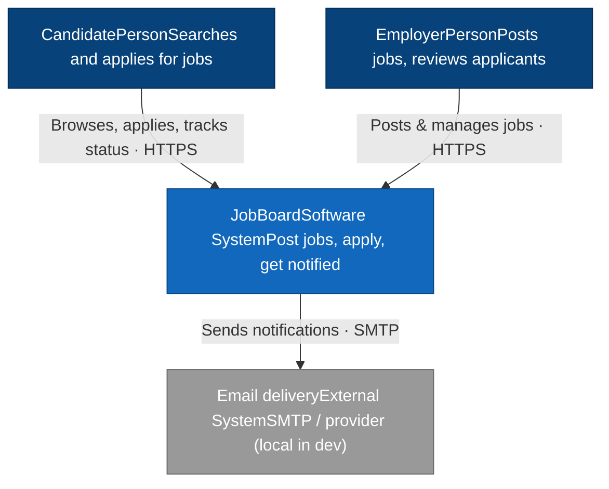
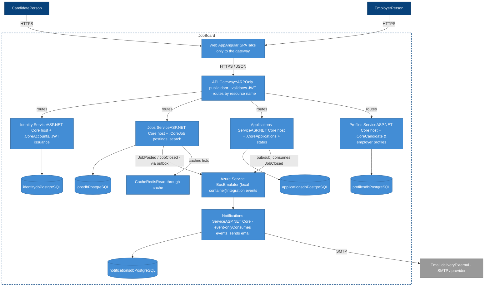
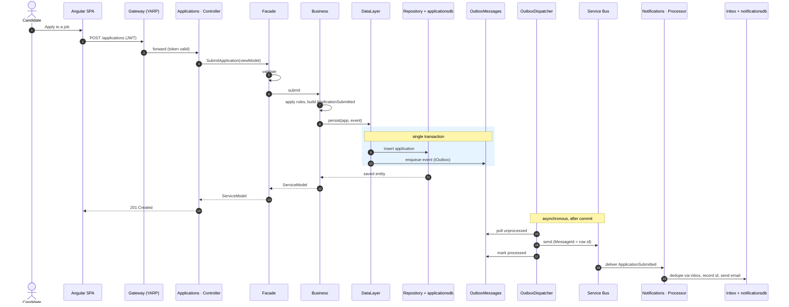
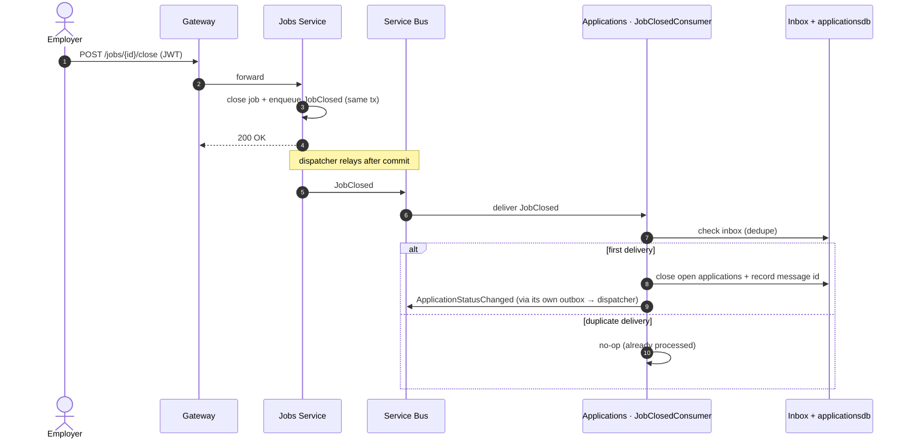
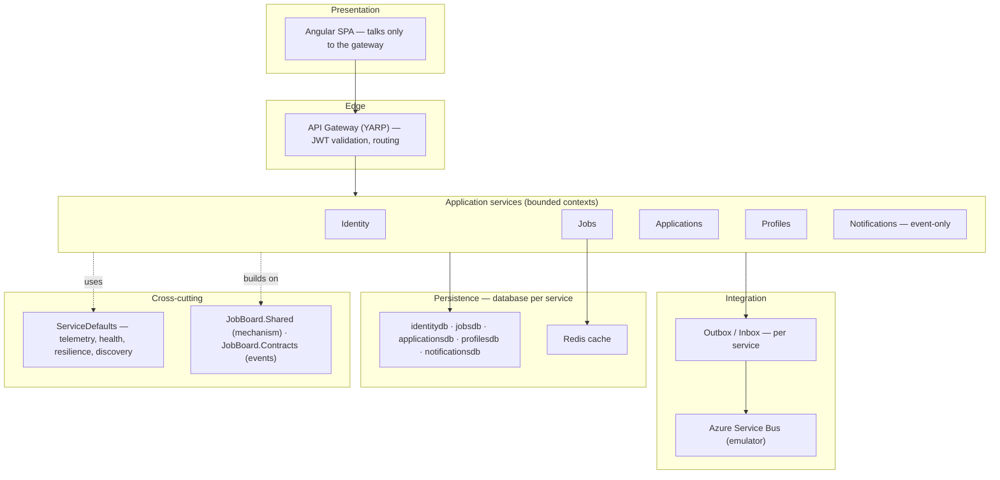
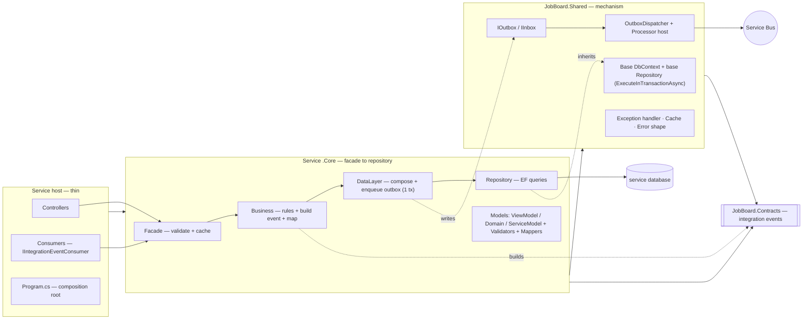

# Job Board

A **reference-architecture** build: a job-board platform where employers post jobs, candidates apply, and everyone is notified — built to demonstrate an event-driven **microservice** system on **Aspire + ASP.NET Core + Angular (.NET 10)**.

JobBoard does two things at once. It's a genuinely functional job board, and it's a public, end-to-end demonstration of driving a _multi-service_ stack with Claude Code using my **SCRUB-driven framework**. The application is the proof; the framework is the point.

## What "reference architecture" means here

This is a prototypical build, not a product. It exists to prove one thing: that an event-driven microservice system can be designed to behave correctly when things go wrong — not just when the demo goes right — and that the whole thing can be driven agentically without the architecture drifting.

Concretely, that means it's:

- **Prototypical, not bespoke.** Five bounded services behind a single gateway, each a thin ASP.NET Core host plus a `.Core` library, each owning its own PostgreSQL database. The patterns are meant to be lifted and reused, not admired once.
- **Correct under failure by design.** A hand-rolled transactional outbox, an idempotent inbox, at-least-once delivery, retries, and dead-lettering are first-class parts of the build — not features bolted on later.
- **Local by default, honest about it.** The whole system runs on Aspire-orchestrated local containers at zero cloud spend, but talks to the real Azure Service Bus SDK through an emulator. Going live is a configuration and DevOps change, not a rewrite.
- **Boundary-safe.** One-way, acyclic references (`Contracts ← Shared ← .Core ← host ← AppHost`); no shared database, ever; the gateway is the only public door.

## Built with the SCRUB framework

The whole system was scaffolded and is maintained through **SCRUB** — a structured prompt skeleton that keeps Claude Code inside the architecture instead of improvising around it. Every non-trivial instruction is shaped as:

```
SCOPE:        what to build/change + which service/project it touches
CONSTRAINT:   the rules to honor (stack, conventions, plan-first)
RESTRICTION:  explicit "do NOT" guardrails
USAGE:        which skills / subagents / tools to use
BEHAVIOR:     how to proceed — plan, approve, small steps, test, report
```

SCRUB isn't just a prompt style — it's wired into the repo. The reusable toolkit lives in `.claude/`:

- **Rules** (`aspire.md`, `backend.md`, `frontend.md`, `messaging.md`, `gateway.md`) — the standing constraints every session loads.
- **Skills** (`add-endpoint`, `add-component`, `add-aspire-resource`) — encoded procedures for the recurring moves, so common work needs no bespoke prompt.
- **Subagents** (`code-reviewer`, `test-gap-analyzer`, `api-contract-checker`) — automated guardrails on the high-stakes checks.
- **Hooks** — enforcement at the seams.
- **`CLAUDE.md`** — project memory, itself written as a SCRUB prompt, loaded every session, so every rule has one obvious home and every misstep is diagnosable by section.

The build sequence follows the same discipline. Because this is a _microservice_ system, the sequence stands up the shared spine first, proves **one** service and the **whole messaging loop** end-to-end, and only then fans the proven pattern out to the rest. The golden rule: don't fan out to five services until one service and the full event loop actually work.

Once the system is scaffolded, most day-to-day work needs no bespoke prompt — the rules, skills, subagents, and hooks carry the structure, so short instructions are enough. Reach for a full SCRUB prompt only when a task is non-trivial or crosses the bus; and when you reuse one two or three times, promote it to a skill so you stop needing the prompt at all.

## Architecture at a glance

- **Gateway** (YARP) — the only public door; the Angular app talks to nothing else.
- **Services** — `Identity`, `Jobs`, `Applications`, `Profiles`, `Notifications`. Each is a **thin host** + a **`.Core`** class library (facade → business → data → repository), with **its own database**. No shared database, ever.
- **Shared** — `JobBoard.Shared` (cross-cutting mechanism: base context, base repository, outbox/inbox, dispatcher, processor host, exception handler, cache) and `JobBoard.Contracts` (integration-event records — the only shared _contract_).
- **Messaging** — Azure Service Bus (emulator in dev) with a **hand-rolled transactional outbox**; consumers are idempotent via an inbox.

The full ruleset is in `CLAUDE.md` and `.claude/rules/`.

## Architecture diagrams

> Rendered with [Mermaid](https://mermaid.js.org/) — GitHub renders these inline. The C4 views
> (Context and Container) are drawn as **styled flowcharts** rather than Mermaid's native `C4Context`/ `C4Container` types, which are experimental and don't render on GitHub — the flowchart versions carry
> the same C4 semantics (people, systems, containers, boundary) and render everywhere. The diagrams
> describe the target system the SCRUB prompts build, not the current (toolkit-only) state of `src/`.

### C4 — System Context

Who uses JobBoard and what it depends on beyond its own boundary.



### C4 — Container

The runtime pieces inside the boundary. Each service is a thin ASP.NET Core host plus its `.Core` library, and owns its own PostgreSQL database. The gateway is the only public door; services talk to
each other only over Service Bus.



### Sequence — Submit an application (write + outbox + async notify)

The synchronous request path commits the domain row **and** the outbox row in one transaction; the
dispatcher relays to Service Bus afterward; the consumer dedupes via its inbox.



### Sequence — Close a job (cross-service cascade)

One event, two databases, no shared table. The consumer writes only its own store and is idempotent.



### Conceptual — System layers

A logical view of the concerns, independent of deployment. Each application service is a bounded
context; integration is always through the bus, never a shared database.



### Conceptual — Per-service layering & project boundaries

Inside one service: a thin host (entry points + composition root) over a `.Core` library (facade →
repository), both built on `JobBoard.Shared`. References point one way: `Contracts ← Shared ← .Core ← host`.



## Getting started

1. Prerequisites: the .NET 10 SDK, the Aspire CLI, Node.js, and a container runtime (Docker/Podman).
2. Make the hooks executable: `chmod +x .claude/hooks/*.sh`
3. Open Claude Code and run the prompts in `docs/scrub-prompts.md` **in order**, one at a time — they stand up the shared spine, prove one service and the full event loop, then fan out.
4. Once `src/` exists, run the whole system with the dashboard:

```
aspire run
```

> Verify exact Aspire and Azure Service Bus emulator commands/API names against [https://aspire.dev](https://aspire.dev) — the framework ships fast and some surface moves between versions.

## License

MIT.
