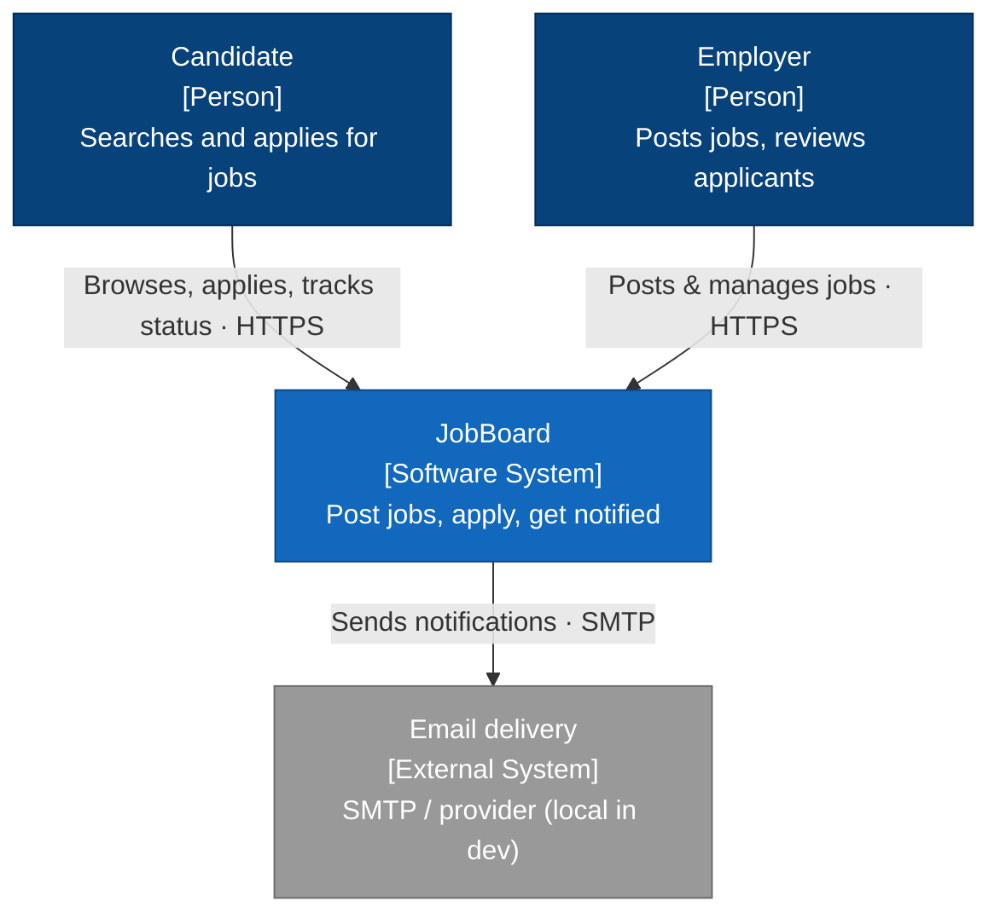
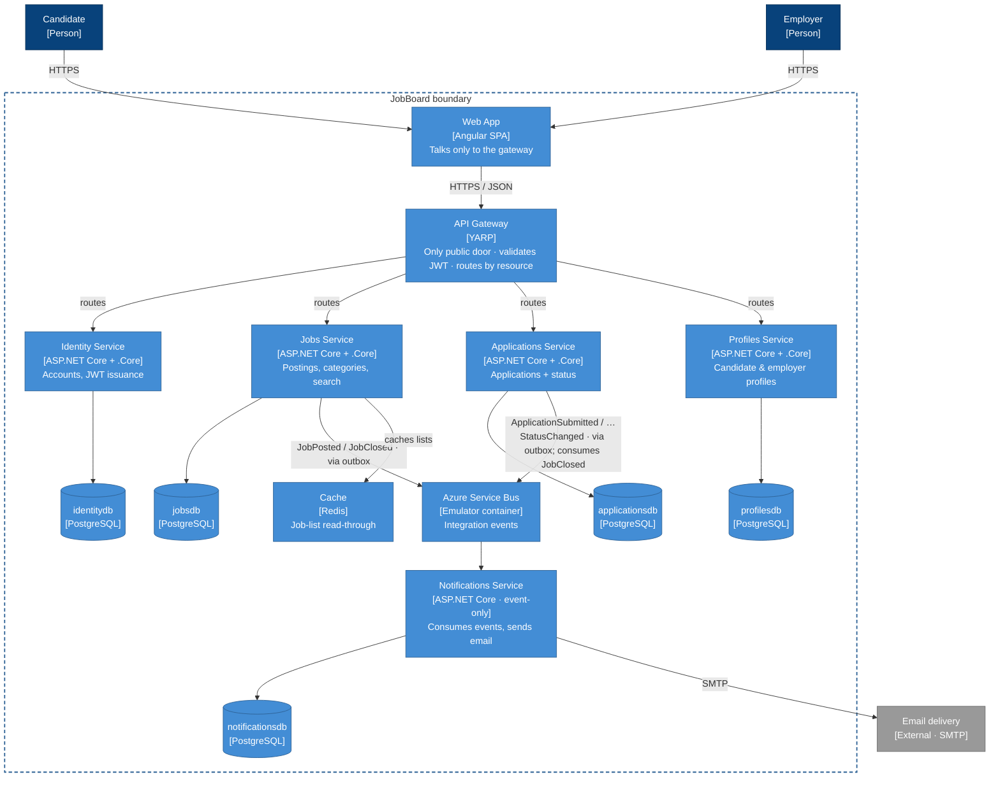
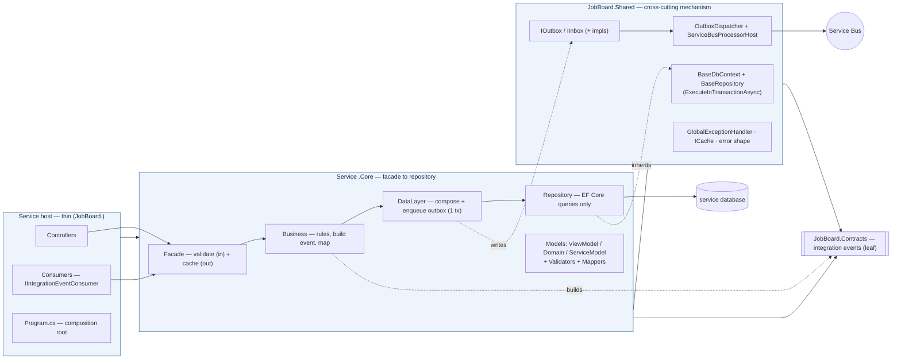
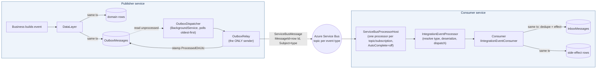
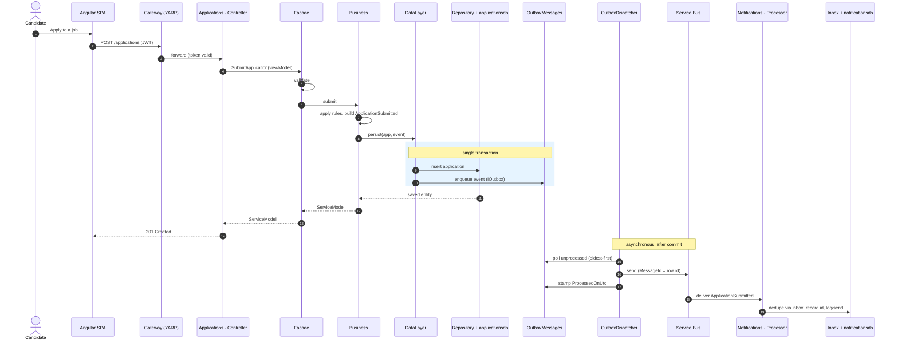
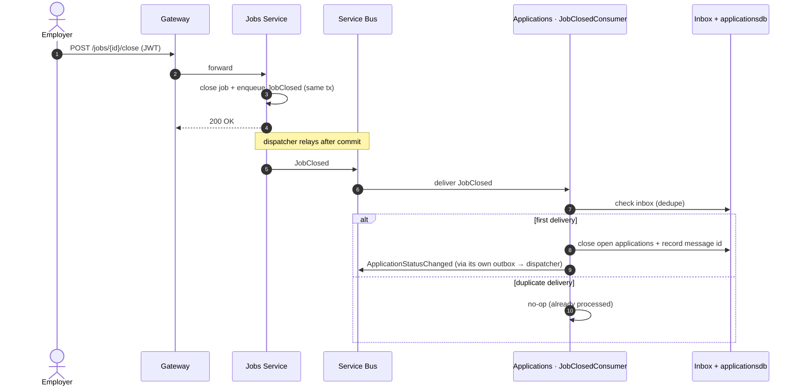
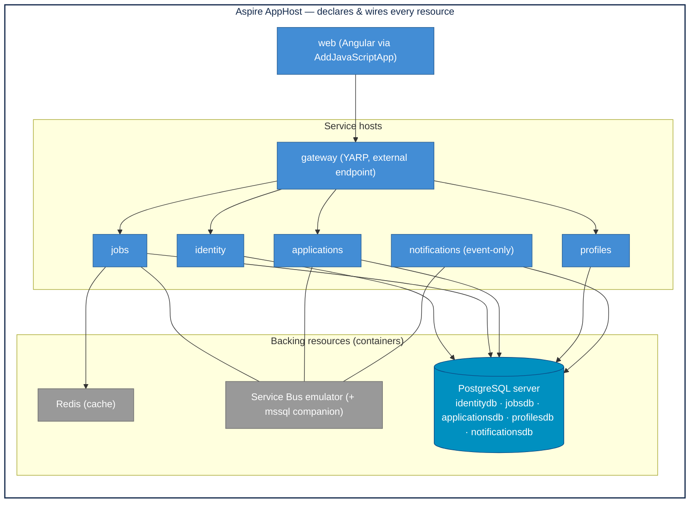
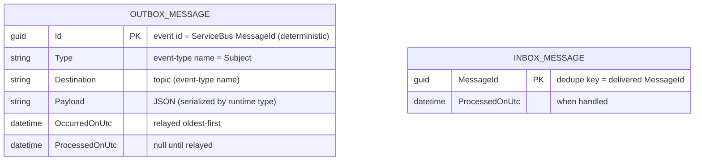

# JobBoard — High-Level Design (HLD)

**Status:** Living document · **Last updated:** 2026-07-18 · **Owner:** Robert Felkins (Architect4Hire)
**Scope of this document:** the *target* architecture the repository builds — an event-driven microservice job board on **Aspire + ASP.NET Core + Angular (.NET 10)** — and the design decisions that hold it together

## 1. Purpose & context

JobBoard is a **reference-architecture** build: a genuinely functional job board *and* a public demonstration of driving a multi-service stack with Claude Code under the SCRUB framework. Employers post jobs, candidates apply, and everyone is notified. The application is the proof; the method is the point.

The design goal is narrow and deliberate: prove that an event-driven microservice system can be built to **behave correctly when things go wrong** — not just when the demo goes right — and that it can be driven agentically without the architecture drifting.

### 1.1 Goals

- **Prototypical, reusable patterns** — five bounded services behind one gateway, each a thin host + a `.Core` library, each owning its own database. The patterns are meant to be lifted, not admired once.
- **Correct under failure by design** — a transactional outbox, an idempotent inbox, at-least-once delivery, retries, and dead-lettering are first-class, not bolted on.
- **Local by default, honest about it** — the whole system runs on Aspire-orchestrated local containers at zero cloud spend, but talks to the real Azure Service Bus SDK through an emulator. Going live is a configuration/DevOps change, not a rewrite.
- **Boundary-safe** — one-way, acyclic references; no shared database, ever; the gateway is the only public door.

### 1.2 Non-goals (for now)

- A production deployment, CI/CD, or multi-replica scale-out story (tracked in the [review plan](./ongoing-architecture-plan.md); see §9 *Known gaps*).
- A heavyweight framework substitute for the hand-rolled outbox (MassTransit et al.) — the hand-rolled mechanism is part of the demonstration.
- A CQRS/event-sourcing rig — the read-model *strategy* is named as a pending decision, not pre-built ([ADR-0012]).

### 1.3 Stakeholders & primary use cases

| Actor                         | Primary interactions                                                                             |
| ----------------------------- | ------------------------------------------------------------------------------------------------ |
| **Candidate**                 | Register/log in, browse & search jobs, apply, track application status.                          |
| **Employer**                  | Register/log in, post & close jobs, review applicants, manage company profile.                   |
| **System (internal)**         | React to domain facts across services (close a job → close its applications; any fact → notify). |
| **Email delivery (external)** | Receives outbound notifications (SMTP/provider; local in dev).                                   |

---

## 2. Architecture drivers & quality attributes

The design is optimizeda single transaction; the dispatcher relays afterward; the consumer dedups, in priority order, for:

1. **Correctness under partial failure** — no lost events, no double effects. Drives the outbox/inbox mechanism ([ADR-0003], [ADR-0004]) and execution-strategy-owned transactions ([ADR-0003 §Atomicity under retries]).
2. **Boundary integrity / independent evolvability** — services must not couple through a shared database or synchronous chatter. Drives database-per-service ([ADR-0001]), event-driven integration ([ADR-0002]), and the acyclic reference rule ([ADR-0005]).
3. **Agentic maintainability** — the structure must be legible and enforceable so Claude Code stays inside it. Drives the thin-host/`.Core` layering ([ADR-0005]) and the `.claude/` toolkit.
4. **Local-first developer experience** — one command (`aspire run`) stands up everything. Drives the Aspire topology and the Service Bus emulator ([ADR-0008]).
5. **Read performance on the hot path** — job listings are cached, safely. Drives the fail-open read-through cache ([ADR-0009]).

Security and operability (observability to the bus/DB, deployment, scale-out) are **acknowledged current weaknesses**, not satisfied attributes — see §9 and the review's 30/60/90 plan.

---

## 3. System context (C4 — Level 1)

Who uses JobBoard and what it depends on beyond its own boundary.

---

## 4. Container view (C4 — Level 2)

The runtime pieces inside the boundary. Each service is a **thin ASP.NET Core host + its `.Core` library** and owns its **own PostgreSQL database**. The **gateway is the only public door**; services integrate **only over Service Bus**, never by reaching into each other's data.

### 4.1 The five bounded contexts

| Service           | Owns                                                | Publishes                                          | Consumes                                                        | Public HTTP           |
| ----------------- | --------------------------------------------------- | -------------------------------------------------- | --------------------------------------------------------------- | --------------------- |
| **Identity**      | `identitydb` — accounts, roles                      | —                                                  | —                                                               | via gateway           |
| **Jobs**          | `jobsdb` — postings, categories, tags               | `JobPosted`, `JobClosed`                           | —                                                               | via gateway           |
| **Applications**  | `applicationsdb` — applications + status lifecycle  | `ApplicationSubmitted`, `ApplicationStatusChanged` | `JobClosed`                                                     | via gateway           |
| **Profiles**      | `profilesdb` — candidate résumés, employer profiles | —                                                  | —                                                               | via gateway           |
| **Notifications** | `notificationsdb` — delivery/notification log       | —                                                  | `JobPosted`, `ApplicationSubmitted`, `ApplicationStatusChanged` | **none** (event-only) |

Cross-service data needs are met by **duplicating the little reference data an event carries** (e.g. a `JobPosted` carries title + location), never by a second connection string or a synchronous call-back ([ADR-0001], [ADR-0002]).

---

## 5. Logical architecture — per-service layering

Inside one service, a **thin host** (entry points + composition root) sits over a **`.Core` library** (facade → business → data layer → repository), both built on **`JobBoard.Shared`**. References point one way only: `Contracts ← Shared ← .Core ← host ← AppHost` ([ADR-0005]).

**Layer responsibilities (enforced by `CLAUDE.md` and `.claude/rules/backend.md`):**

- **Controller / Consumer (host)** — entry points only. Map HTTP/event → facade call. No logic.
- **Facade (`.Core`)** — owns the two seams the layers below must not: **input validation** (FluentValidation `ValidateAndThrowAsync`) and **read-through caching** of outbound ServiceModels. `JobFacade.cs`.
- **Business (`.Core`)** — domain rules, **builds the integration event**, maps domain → ServiceModel. Never touches the cache or EF. `JobBusiness.cs`.
- **Data layer (`.Core`)** — composes repository calls and **enqueues the outbox row in the same transaction** as the domain write (`ExecuteInTransactionAsync`). `JobDataLayer.cs`.
- **Repository (`.Core`)** — EF Core queries only; inherits `BaseRepository<TContext>`.

**Boundary discipline:** only **ViewModels** enter, only **ServiceModels** leave; EF entities never cross a controller; domain types never cross a *service* boundary (statuses cross as strings — [ADR-0011]).

---

## 6. Messaging & reliability — the load-bearing design

Cross-service integration is **asynchronous, fact-based, and correct under failure**. This is the part most microservice attempts get wrong, so it is specified precisely and verified in tests.

### 6.1 Component view of the mechanism (in `JobBoard.Shared`)

### 6.2 Guarantees & how they're achieved

- **Atomic publish.** The integration event is written to the service's own `OutboxMessages` table **in the same transaction** as the domain change (`BaseRepository.ExecuteInTransactionAsync` + a scoped `BaseDbContext` shared by the repository and `IOutbox`). A domain write can never commit without its event, or vice versa. ([ADR-0003])
- **Single sender.** Only `OutboxRelay` (driven by the `OutboxDispatcher` background loop) sends to Service Bus — never business or data code inline. It relays unprocessed rows oldest-first, one sender per destination topic, stamping `ProcessedOnUtc` per row; a failed send stops the batch to preserve order and is retried next poll. ([ADR-0003])
- **At-least-once delivery.** A crash between *send* and *stamp* re-sends the same `MessageId` (the deterministic event `Id`). This is accepted, not fought — the inbox makes it safe. ([ADR-0004])
- **Idempotent consume.** Each consumer checks `InboxMessages` for the `MessageId` and records it **in the same transaction as its side effect**, so a redelivery is a no-op. `AutoCompleteMessages = false`: a message is completed only after the consumer succeeds; a throw leaves it unsettled for redelivery. ([ADR-0004])
- **Own-store only.** A consumer writes **only its own service's database** — reacting to another service's event means doing work in *your* store, never reaching back into the publisher. ([ADR-0001], [ADR-0002])

### 6.3 Topic/subscription topology

The convention is **topic name = event-type name** (so the relay's sender finds it by the outbox row's `Destination`), with one subscription per `(consumer, event)` pair. Declared in `AppHost.cs`:

| Topic (event)              | Subscription                   | Consumer      |
| -------------------------- | ------------------------------ | ------------- |
| `JobClosed`                | `applications-jobclosed`       | Applications  |
| `JobPosted`                | `notifications-jobposted`      | Notifications |
| `ApplicationSubmitted`     | `notifications-submitted`      | Notifications |
| `ApplicationStatusChanged` | `notifications-status-changed` | Notifications |

---

## 7. Key runtime flows (sequences)

### 7.1 Submit an application (synchronous write + outbox + async notify)

The request commits the domain row **and** the outbox row in one transaction; the dispatcher relays afterward; the consumer dedupes via its inbox.

### 7.2 Close a job (cross-service cascade, no shared table)

One event, two databases. The consumer writes only its own store and is idempotent.

---

## 8. Cross-cutting concerns

### 8.1 Security (edge auth)

- **The gateway is the only public door** ([ADR-0006]). Individual services are not exposed to the browser; a service endpoint with no gateway route is unreachable by design.
- **Identity issues** an HMAC-SHA256 (HS256) JWT carrying `sub`, `email`, `role`; the **gateway validates** it against the same issuer/audience/signing key before proxying a protected route ([ADR-0007]). The shared signing key is injected via Aspire env (`Jwt__SigningKey`), never in source.
- **Authorization** is policy-based at the edge (`authenticated` policy on protected YARP routes).
- **Passwords** are hashed with ASP.NET Core's PBKDF2 `PasswordHasher` (per-password salt, versioned format).

> ⚠️ **Known security gaps** (see §9 and the review): object-level authorization is currently **broken** (services trust body-supplied `employerId`/`candidateId` rather than the token's `sub`), role claims are issued but **not enforced** on writes, and the SPA stores the JWT in `localStorage`. These are the top-ranked items in the 30/60/90 plan and are addressed by **[ADR-0011] (Proposed)**.

### 8.2 Observability

Aspire ServiceDefaults wire OpenTelemetry, health checks, resilience, and service discovery. The **dashboard is the front door** for logs/traces/health. *Current gap:* traces do not yet reach the DB or the bus, so publish→consume is uncorrelated (60-day plan item).

### 8.3 Error handling

A shared `GlobalExceptionHandler` maps `DomainException` and `ValidationException` to a consistent error shape (`ErrorResponse`/`ErrorDetail`) with the right status codes (e.g. validation → 400, not-found → 404, conflict → 409).

### 8.4 Caching

The Jobs facade uses a **fail-open read-through cache** with **generation-token invalidation** for the filterable job list; the cache is an optimization, never a source of truth ([ADR-0009]).

### 8.5 Configuration & wiring

Everything is wired through Aspire (`WithReference` / service discovery). No connection strings, broker addresses, or `host:port` literals in code. The one sanctioned exception is the gateway naming services by Aspire resource name (`http://jobs`), which service discovery resolves ([ADR-0008]).

---

## 9. Runtime/deployment view

Today the world is **local**: Aspire's AppHost orchestrates every service, the gateway, the Angular app, and all backing resources (one PostgreSQL server with a database per service, the Service Bus emulator container, Redis) as local containers — no cloud dependencies ([ADR-0008]).

**Path to production** (not yet built — 60/90-day plan): container build per host + an Aspire manifest / `azd` target (or Compose for a simple demo); health checks promoted out of the Development-only block; a scale-out-safe outbox claim (`FOR UPDATE SKIP LOCKED`) before running >1 replica of a publisher ([ADR-0003 §Consequences]); dead-letter policy on poison messages.

---

## 10. Data architecture

**Database-per-service**, no shared schema. Each service's `.Core` owns its `DbContext`, entity configurations, and migrations. Two cross-cutting tables live in *every* service database via `BaseDbContext`: `OutboxMessages` and `InboxMessages`.

- **Per-service domain tables** (illustrative): `jobsdb` → jobs, categories, tags; `applicationsdb` → applications (+ status); `identitydb` → accounts; `profilesdb` → candidate/employer profiles; `notificationsdb` → notification/delivery log.
- **Migrations** live in `<Service>.Core` (where the `DbContext` is) but run with the host as startup project (where DI/config resolve) — see `CLAUDE.md` for the exact `dotnet ef` commands.
- **Consistency model:** strong consistency *within* a service transaction; **eventual consistency across services** via events. There is no distributed transaction and no 2PC — the outbox is the deliberate alternative ([ADR-0003]).

---

## 11. Known gaps & roadmap

This HLD documents the target design; the current build is an **excellent spike with real, named holes**. The authoritative, ranked list and sequencing live in [`docs/design/ongoing-architecture-plan.md`](./ongoing-architecture-plan.md). In brief:

| Horizon     | Theme                       | Headline items                                                                                                                                                                                         |
| ----------- | --------------------------- | ------------------------------------------------------------------------------------------------------------------------------------------------------------------------------------------------------ |
| **30 days** | Security & honesty          | Fix the identity/BOLA seam ([ADR-0011]), enforce role authz, stand up CI, resolve the Notifications "sends no email" gap, kill the spurious-`ApplicationStatusChanged` race, add CORS + rate limiting. |
| **60 days** | Observability & operability | Trace to the bus and DB (propagate `traceparent` through the outbox), container/deploy story, auth hardening (refresh tokens, move JWT off `localStorage`, consider RS256), close top test gaps.       |
| **90 days** | Earn the right to scale     | Scale-out-safe outbox claim, dead-letter/poison policy, decide the read-model strategy ([ADR-0012]), optimistic concurrency where last-write-wins becomes a real conflict.                             |

---

## 12. Architecture Decision Records

The load-bearing decisions are captured as ADRs. See the [ADR index](../adr/README.md).

| ADR                                                              | Decision                                                              | Status   |
| ---------------------------------------------------------------- | --------------------------------------------------------------------- | -------- |
| [0001](../adr/0001-microservices-database-per-service.md)         | Microservices with database-per-service (bounded contexts)            | Accepted |
| [0002](../adr/0002-event-driven-integration-over-service-bus.md)  | Event-driven integration over Azure Service Bus (facts, not commands) | Accepted |
| [0003](../adr/0003-hand-rolled-transactional-outbox.md)           | Hand-rolled transactional outbox as the publish mechanism             | Accepted |
| [0004](../adr/0004-idempotent-inbox-at-least-once-delivery.md)    | Idempotent inbox over at-least-once delivery                          | Accepted |
| [0005](../adr/0005-thin-host-core-layered-library.md)             | Thin host + `.Core` layered library; one-way acyclic references       | Accepted |
| [0006](../adr/0006-single-api-gateway-yarp.md)                    | Single YARP gateway as the only public door                           | Accepted |
| [0007](../adr/0007-identity-issued-symmetric-jwt.md)              | Identity-issued symmetric (HS256) JWT validated at the edge           | Accepted |
| [0008](../adr/0008-aspire-local-first-servicebus-emulator.md)     | Aspire local-first topology + Service Bus emulator                    | Accepted |
| [0009](../adr/0009-read-through-cache-generation-invalidation.md) | Fail-open read-through cache with generation-token invalidation       | Accepted |
| [0010](../adr/0010-contracts-leaf-status-as-string.md)            | Contracts as a leaf library; status crosses as strings                | Accepted |
| [0011](../adr/0011-token-derived-identity-propagation.md)         | Token-derived identity propagation at the gateway                     | Proposed |
| [0012](../adr/0012-cross-service-read-model-strategy.md)          | Cross-service read-model / query composition strategy                 | Proposed |
