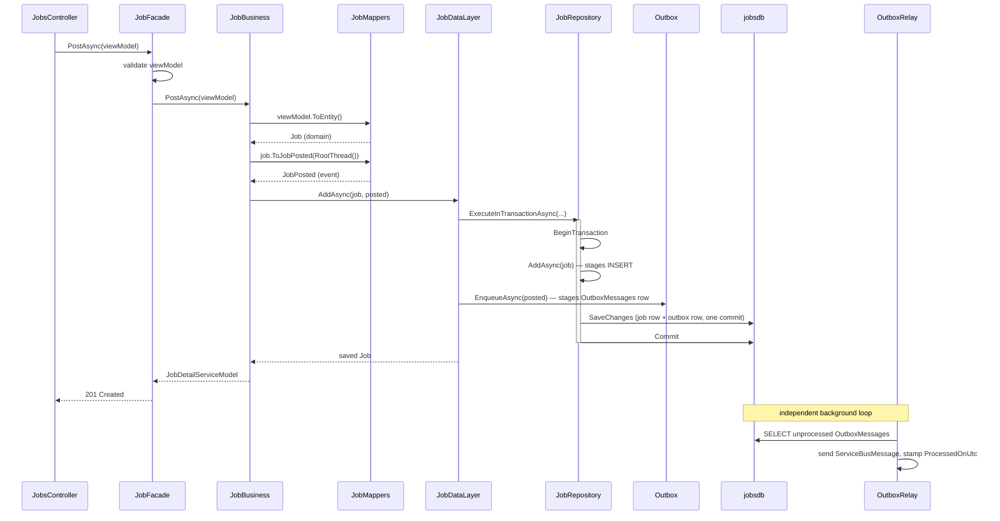

# Tracing the Outbox: `JobPosted`, Facade to Repository

*One event, every layer, real code at each hop. Where*
[*Transactional Outbox & Inbox*](./patterns/transactional-outbox-and-inbox.md) *explains the mechanism in
the abstract, this doc walks a single request — `POST /jobs` — through the concrete layers that build,
carry, and commit its event, so you can see exactly which method touches the event at each step.*

## The event

[`JobPosted`](../../src/JobBoard.Contracts/JobPosted.cs) — Jobs' fact that a new posting went live,
consumed today by Notifications:

```csharp
public sealed record JobPosted(
    Guid Id,
    Guid JobId,
    Guid EmployerId,
    string Title,
    string Location,
    DateTime PostedOnUtc) : IIntegrationEvent
{
    public Guid CorrelationId { get; init; }
    public Guid CausationId { get; init; }
    public Guid? ActorId { get; init; }
}
```

The trigger is `POST /jobs` on [`JobsController`](../../src/JobBoard.Jobs/Controllers/JobsController.cs).
Six things happen to this event before it's on the wire: it's **built** (Business), **mapped** from the
`Job` entity (a mapper), **enqueued** as a row in the same transaction as the insert (Data layer), the
insert and enqueue are **committed together** (Repository via the Shared base repository), and only then
is it **relayed** to Service Bus by a background dispatcher that never touched the request at all.



Notice the request's own path (top half) never calls Service Bus. It ends the moment the transaction
commits — the `201 Created` goes back to the caller before the event has left the building. The relay
(bottom) runs on its own timer and finds the row later.

## Layer by layer

### 1. Controller — bind and delegate

[`JobsController.Post`](../../src/JobBoard.Jobs/Controllers/JobsController.cs) does nothing but bind the
view model and call the facade. It never sees `JobPosted` — that's built two layers down.

```csharp
[HttpPost]
public async Task<ActionResult<JobDetailServiceModel>> Post(
    [FromBody] PostJobViewModel viewModel,
    CancellationToken cancellationToken)
{
    var job = await _facade.PostAsync(viewModel, cancellationToken);
    return CreatedAtAction(nameof(Get), new { id = job.Id }, job);
}
```

### 2. Facade — validate, then get out of the way

[`JobFacade.PostAsync`](../../src/JobBoard.Jobs.Core/Facade/JobFacade.cs) validates the inbound
`PostJobViewModel` (a bad request never reaches business or the database) and, after the write succeeds,
invalidates the list cache. It has no idea an event exists — that's business's job, not the facade's.

```csharp
public async Task<JobDetailServiceModel> PostAsync(PostJobViewModel viewModel, CancellationToken cancellationToken = default)
{
    await _postValidator.ValidateAndThrowAsync(viewModel, cancellationToken);
    var posted = await _business.PostAsync(viewModel, cancellationToken);
    await InvalidateListAsync(cancellationToken); // a new posting joins the cached list
    return posted;
}
```

### 3. Business — translate, then *build* the event

[`JobBusiness.PostAsync`](../../src/JobBoard.Jobs.Core/Business/JobBusiness.cs) is where `JobPosted`
actually comes into existence. Two mapper calls do the translation; business itself only decides *that*
an event is warranted and hands both the entity and the event down together:

```csharp
public async Task<JobDetailServiceModel> PostAsync(PostJobViewModel viewModel, CancellationToken cancellationToken = default)
{
    var job = viewModel.ToEntity();
    // A post is a fact other services care about (Notifications logs it): build JobPosted and hand it
    // to the data layer, which enqueues it in the same transaction as the insert. The post is the root
    // of its request thread, so the event carries the request's own correlation/actor (ADR-0013).
    var posted = job.ToJobPosted(_requestContext.RootThread());
    var saved = await _dataLayer.AddAsync(job, posted, cancellationToken);
    return saved.ToDetailServiceModel();
}
```

`_requestContext.RootThread()` ([`AuditThreadExtensions.RootThread`](../../src/JobBoard.Shared/Requests/AuditThreadExtensions.cs))
is what stamps `CorrelationId`/`CausationId`/`ActorId` — since this is a request-initiated event (not a
reaction to another event), causation is the request's own correlation id: there is no parent event.

### 4. Mappers — the two translations, and the one that builds the event

[`JobMappers`](../../src/JobBoard.Jobs.Core/Managers/Mappers/JobMappers.cs) owns every shape change
`JobPosted` goes through. `ToEntity` turns the inbound view model into the domain `Job` that gets
persisted; `ToJobPosted` turns the *saved* entity's shape into the event that gets published — a
**separate** mapping, because the event's fields (denormalized `Title`/`Location`, no `Description`, a
fresh `Id`) are not the entity's fields:

```csharp
public static Job ToEntity(this PostJobViewModel vm) => new()
{
    Id = Guid.NewGuid(),
    Title = vm.Title,
    Description = vm.Description,
    Location = vm.Location,
    Salary = new SalaryBand { Min = vm.Salary.Min, Max = vm.Salary.Max, Currency = vm.Salary.Currency },
    Status = JobStatus.Open,
    EmployerId = vm.EmployerId,
    CreatedOnUtc = DateTime.UtcNow,
    Categories = vm.Categories.Select(c => new Category { Id = Guid.NewGuid(), Name = c.Name, Slug = c.Slug }).ToList(),
    Tags = vm.Tags.Select(t => new Tag { Id = Guid.NewGuid(), Name = t.Name, Slug = t.Slug }).ToList(),
};

/// <summary>
/// Builds the <see cref="JobPosted"/> fact for a job that has just been created, stamping a fresh
/// event id (its outbox-row key and Service Bus <c>MessageId</c>) and the audit <paramref name="thread"/>
/// (ADR-0013). Carries the denormalized title and location a consumer needs, and reuses the job's
/// creation time as the posted time.
/// </summary>
public static JobPosted ToJobPosted(this Job job, AuditThread thread) =>
    new(Guid.NewGuid(), job.Id, job.EmployerId, job.Title, job.Location, job.CreatedOnUtc)
    {
        CorrelationId = thread.CorrelationId,
        CausationId = thread.CausationId,
        ActorId = thread.ActorId,
    };
```

`Guid.NewGuid()` here is not incidental — that new id becomes the outbox row's primary key *and* the
Service Bus `MessageId` later. It is minted once, in the mapper, and carried unchanged through every
layer below; nothing downstream regenerates it. (`ToDetailServiceModel`, the third mapping business
calls on the way out, has nothing to do with the event — it shapes the HTTP response.)

### 5. Data layer — enqueue in the *same* transaction as the write

[`JobDataLayer.AddAsync`](../../src/JobBoard.Jobs.Core/Data/JobDataLayer.cs) is where the event stops
being just an object business built and becomes a durable row. It composes one repository call (the
insert) and one outbox call (the enqueue) inside a single `ExecuteInTransactionAsync`:

```csharp
public async Task<Job> AddAsync(Job job, JobPosted @event, CancellationToken cancellationToken = default)
{
    try
    {
        return await _repository.ExecuteInTransactionAsync(
            async token =>
            {
                var saved = await _repository.AddAsync(job, token);
                await _outbox.EnqueueAsync(@event, token);
                return saved;
            },
            cancellationToken);
    }
    catch (DbUpdateException ex) when (JobRepository.IsDuplicateSlugViolation(ex))
    {
        throw new DomainException(
            "job.classification_conflict",
            "A category or tag with the same slug was just created. Please retry.",
            StatusCodes.Status409Conflict);
    }
}
```

Neither `_repository.AddAsync` nor `_outbox.EnqueueAsync` calls `SaveChanges` — both only *stage* changes
on the same `DbContext`'s change tracker. That's deliberate: it's what lets the transaction boundary
below flush and commit them as one unit.

### 6. Repository — stage the domain write, nothing else

[`JobRepository.AddAsync`](../../src/JobBoard.Jobs.Core/Data/JobRepository.cs) never sees the event at
all — the outbox row isn't a domain concern, so it's not the repository's job. It reconciles categories
and tags against existing rows by slug, then stages the job for insert:

```csharp
public async Task<Job> AddAsync(Job job, CancellationToken cancellationToken = default)
{
    job.Categories = await ReconcileAsync(job.Categories, Context.Categories, cancellationToken);
    job.Tags = await ReconcileAsync(job.Tags, Context.Tags, cancellationToken);

    await Context.Jobs.AddAsync(job, cancellationToken);
    return job;
}
```

The transaction boundary itself — `ExecuteInTransactionAsync` — isn't reimplemented per repository; it's
inherited from [`BaseRepository<TContext>`](../../src/JobBoard.Shared/Persistence/BaseRepository.cs) in
`JobBoard.Shared`, the one place every service gets it from:

```csharp
public async Task<T> ExecuteInTransactionAsync<T>(
    Func<CancellationToken, Task<T>> operation,
    CancellationToken cancellationToken = default)
{
    var strategy = Context.Database.CreateExecutionStrategy();

    return await strategy.ExecuteAsync(async token =>
    {
        await using var transaction = await Context.Database.BeginTransactionAsync(token);
        var result = await operation(token);
        // Flush anything the operation staged (the job row AND the outbox row) inside the transaction,
        // then commit them together. A throw on any leg skips the commit and rolls both back.
        await Context.SaveChangesAsync(token);
        await transaction.CommitAsync(token);
        return result;
    }, cancellationToken);
}
```

This single `SaveChangesAsync` is the moment `JobPosted` becomes durable — it flushes the staged `Job`
insert and the staged `OutboxMessages` insert (from step 7) in one `SaveChanges` call, inside one
transaction. Either both rows land, or (on a thrown exception) neither does.

### 7. Outbox — the event becomes a row

[`Outbox.EnqueueAsync`](../../src/JobBoard.Shared/Messaging/Outbox.cs) — also in `JobBoard.Shared`, so
every service enqueues the same way — turns the `JobPosted` object into an `OutboxMessage` row on the
*same* `DbContext` the job insert is using:

```csharp
public async Task EnqueueAsync(IIntegrationEvent @event, CancellationToken cancellationToken = default)
{
    var existing = await _context.OutboxMessages.FindAsync([@event.Id], cancellationToken);
    if (existing is not null) return; // deterministic id → replay-safe

    var eventType = @event.GetType();
    var message = new OutboxMessage
    {
        Id = @event.Id,                 // JobPosted.Id, minted in the mapper — becomes the row's PK
        Type = eventType.Name,          // "JobPosted"
        Destination = eventType.Name,   // topic-per-event-type convention
        Payload = JsonSerializer.Serialize(@event, eventType, SerializerOptions),
        OccurredOnUtc = DateTime.UtcNow,
        ProcessedOnUtc = null,
    };

    await _context.OutboxMessages.AddAsync(message, cancellationToken);
}
```

The [`OutboxMessage`](../../src/JobBoard.Shared/Persistence/OutboxMessage.cs) shape it fills in:

```csharp
public sealed class OutboxMessage
{
    public Guid Id { get; set; }
    public string Type { get; set; } = default!;
    public string Destination { get; set; } = default!;
    public string Payload { get; set; } = default!;
    public DateTime OccurredOnUtc { get; set; }
    public DateTime? ProcessedOnUtc { get; set; } // null until the relay sends it
}
```

Note what *doesn't* happen here: no `SaveChangesAsync`, no `ServiceBusClient`. `EnqueueAsync` only stages
the row — step 6's `SaveChangesAsync` (called by the data layer's caller, the repository's transaction
wrapper) is what actually writes it, alongside the `Job` row, in the same round-trip to `jobsdb`.

### 8. After the commit — the relay, on its own clock

Everything above runs inside the HTTP request. What happens next runs independently: `OutboxDispatcher`
(a `BackgroundService`) polls on a timer, and for each tick hands a fresh scope's `DbContext` to
[`OutboxRelay.RelayAsync`](../../src/JobBoard.Shared/Messaging/OutboxRelay.cs), which finds the row this
request just committed and sends it:

```csharp
var pending = await context.OutboxMessages
    .Where(m => m.ProcessedOnUtc == null)
    .OrderBy(m => m.OccurredOnUtc)
    .Take(_options.BatchSize)
    .ToListAsync(cancellationToken);

foreach (var row in pending)
{
    var sender = _senders.GetOrAdd(row.Destination, _client.CreateSender);
    var message = new ServiceBusMessage(row.Payload) { MessageId = row.Id.ToString(), Subject = row.Type };
    await sender.SendMessageAsync(message, cancellationToken);
    row.ProcessedOnUtc = DateTime.UtcNow;
    // a failed send breaks the loop so ordering holds and the row retries next poll
}
await context.SaveChangesAsync(cancellationToken);
```

`MessageId = row.Id.ToString()` is the same `Guid` the mapper minted in step 4, unchanged across seven
layers. That's what lets a crash between the send and the `ProcessedOnUtc` stamp resend the *same*
`JobPosted` without becoming a duplicate downstream — the consumer's inbox dedupes on this id. The relay
and the inbox side are the general mechanism, covered in full in
[Transactional Outbox & Inbox](./patterns/transactional-outbox-and-inbox.md); this doc stops here, at the
edge of the publishing service, because that's the boundary `JobPosted`'s identity is established within.

## What to notice

- **The event is built once, in business, from a mapper — nothing upstream or downstream rebuilds it.**
  The controller and facade never touch `JobPosted`; the repository and outbox never touch
  `PostJobViewModel`. Each layer sees exactly one shape.
- **Two mappers, two different sources.** `ToEntity` maps the *view model* → domain; `ToJobPosted` maps
  the *domain entity* (after `Id`/`CreatedOnUtc` are set) → event. Conflating them would either leak
  view-model fields into the event or miss fields the event needs that the view model never carried.
- **The event's identity is minted exactly once and never changes.** `Guid.NewGuid()` in the mapper
  becomes the outbox row's `Id`, then the Service Bus `MessageId`. Every retry-safety guarantee in this
  pattern — the outbox's duplicate-enqueue check, the inbox's dedupe — depends on that id staying the
  same from mint to consumption.
- **Nothing before the outbox row is committed calls Service Bus, and nothing after it is committed
  calls the database (except to stamp `ProcessedOnUtc`).** The request-time path and the relay's
  background path touch the row exactly once each, at different times, and never in the same
  transaction.

## Reference map

| Step | Layer | File |
| --- | --- | --- |
| 1 | Controller | [`JobsController.cs`](../../src/JobBoard.Jobs/Controllers/JobsController.cs) |
| 2 | Facade | [`JobFacade.cs`](../../src/JobBoard.Jobs.Core/Facade/JobFacade.cs) |
| 3 | Business (builds the event) | [`JobBusiness.cs`](../../src/JobBoard.Jobs.Core/Business/JobBusiness.cs) |
| 4 | Mappers (`ToEntity`, `ToJobPosted`) | [`JobMappers.cs`](../../src/JobBoard.Jobs.Core/Managers/Mappers/JobMappers.cs) |
| 5 | Data layer (atomic enqueue) | [`JobDataLayer.cs`](../../src/JobBoard.Jobs.Core/Data/JobDataLayer.cs) |
| 6 | Repository + transaction boundary | [`JobRepository.cs`](../../src/JobBoard.Jobs.Core/Data/JobRepository.cs) · [`BaseRepository.cs`](../../src/JobBoard.Shared/Persistence/BaseRepository.cs) |
| 7 | Outbox (event → row) | [`IOutbox.cs`](../../src/JobBoard.Shared/Messaging/IOutbox.cs) · [`Outbox.cs`](../../src/JobBoard.Shared/Messaging/Outbox.cs) · [`OutboxMessage.cs`](../../src/JobBoard.Shared/Persistence/OutboxMessage.cs) |
| 8 | Relay (row → Service Bus) | [`OutboxRelay.cs`](../../src/JobBoard.Shared/Messaging/OutboxRelay.cs) · [`OutboxDispatcher.cs`](../../src/JobBoard.Shared/Messaging/OutboxDispatcher.cs) |
| — | The event contract | [`JobPosted.cs`](../../src/JobBoard.Contracts/JobPosted.cs) |
| — | Audit thread stamped by business | [`AuditThread.cs`](../../src/JobBoard.Shared/Requests/AuditThread.cs) · [`AuditThreadExtensions.cs`](../../src/JobBoard.Shared/Requests/AuditThreadExtensions.cs) |

## Related reading

- [Transactional Outbox & Inbox](./patterns/transactional-outbox-and-inbox.md) — the general mechanism:
  why it exists, the receive-side inbox, and a consumer that both consumes and republishes.
- [Layered Service Architecture](./patterns/layered-service-architecture.md) — why the stack is
  Controller → Facade → Business → Data → Repository at all, and what belongs in each layer.
- [Tracing a Slice: Applying to a Job](../tracing-a-slice-apply-to-a-job.md) — the wider version of this
  walkthrough: `ApplicationSubmitted`, start to finish, including the gateway hop and two independent
  consumers.
- [Correlation, Causation & the Audit Trail](./patterns/correlation-causation-and-audit-trail.md) — what
  `RootThread()` is doing in step 3, and why causation differs for a follow-on event.
